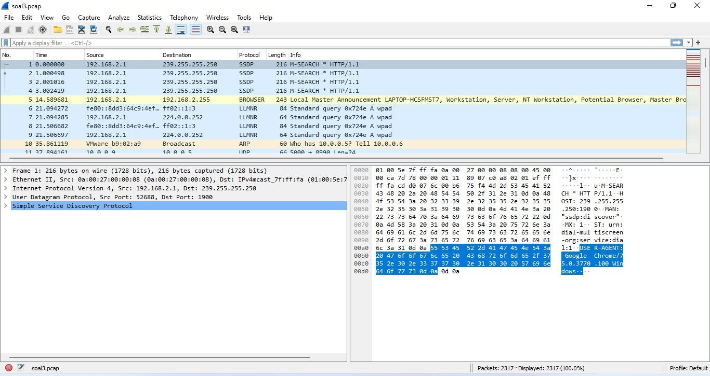

# Jaringan Komputer A
Ariella Firdaus Imata (5025211138)  
Richard Ryan (5025211141)  
Modul 1  
Kelompok A14  

## 1 User melakukan berbagai aktivitas dengan menggunakan protokol FTP. Salah satunya adalah mengunggah suatu file
### a Berapakah sequence number (raw) pada packet yang menunjukkan aktivitas tersebut? 


Kita dapat mendapatkan sequence number raw dengan filter protokolnya yaitu FTP dan mencari paket yang melakukan proses STOR *(ftp contains "STOR")*. Pada kasus ini adalah pada paket nomor 147 (Mengunggah c75-GrabThePhiser.zip). Kita buka detail paketnya dan lihat sequence numbernya, yaitu **258040667**.

### b Berapakah acknowledge number (raw) pada packet yang menunjukkan aktivitas tersebut?
Kita dapat mendapatkan acknowledge number raw dengan filter protokolnya yaitu FTP dan mencari paket yang melakukan proses STOR *(ftp contains "STOR")*. Pada kasus ini adalah pada paket nomor 147 (Mengunggah c75-GrabThePhiser.zip). Kita buka detail paketnya dan lihat acknowledge numbernya, yaitu **1044861039**. 

### c Berapakah sequence number (raw) pada packet yang menunjukkan response dari aktivitas tersebut?


Kita cari packet yang melakukan response dari soal a dan b, yaitu pada packet no 149. Lalu kita lihat sequence numbernya seperti soal a dan b, yaitu **1044861039**

### d Berapakah acknowledge number (raw) pada packet yang menunjukkan response dari aktivitas tersebut?
Kita cari packet yang melakukan response dari soal a dan b, yaitu pada packet no 149. Lalu kita lihat acknowledge numbernya seperti soal a dan b, yaitu **258040696**

---

## 2 Sebutkan web server yang digunakan pada portal praktikum Jaringan Komputer!
1) Buka file pcap dengan wireshark

2) IP dari portal praktikum Jaringan Komputer adalah 10.21.78.111, maka lakukan filter ```ip.dst == 10.21.78.111```

3) Pilih paket yang memanggil fungsi GET, kemudian klik kanan dan pilih Follow -> HTTP Stream


   Didapat bahwa Web Server yang digunakan pada portal praktikum Jaringan Komputer adalah gunicorn
   
---

## 3 Dapin sedang belajar analisis jaringan. Bantulah Dapin untuk mengerjakan soal berikut:
### a Berapa banyak paket yang tercapture dengan IP source maupun destination address adalah 239.255.255.250 dengan port 3702?
1) Buka file pcap dengan wireshark
   
3) Gunakan display filter sebagai berikut ```(ip.src == 239.255.255.250 && tcp.port == 3702) || (ip.src == 239.255.255.250 && udp.port == 3702) || (ip.dst == 239.255.255.250 && tcp.port == 3702) || (ip.dst == 239.255.255.250 && udp.port == 3702)```  
   Penjelasan :
   - IP dengan source maupun address berarti perlu digunakan ip.src serta ip.dst dalam filter
   - Port 3702 bisa berupa port TCP maupun port UDP, sehingga keduanya perlu digunakan
   - Display filter tersebut merupakan gabungan semua kombinasi src-dst serta TCP-UDP


Didapat bahwa terdapat 21 paket yang tercapture

### b Protokol layer transport apa yang digunakan?
Dari 21 paket yang tercapture, semua protokol yang digunakan adalah UDP

---

## 4 Berapa nilai checksum yang didapat dari header pada paket nomor 130?
1) Buka file pcap dengan wireshark

2) Cari paket 130, dan buka header filenya, cari bagian checksumnya

Didapat bahwa checksum dari header pada paket 130 adalah ```0x18e5```

---

## 5 Elshe menemukan suatu file packet capture yang menarik. Bantulah Elshe untuk menganalisis file packet capture tersebut.
Soal tidak langsung tersedia, maka harus dilakukan sedikit investigasi terlebih dahulu  
1) Buka file pcap dengan wireshark

3) Pilih salah satu SMTP yang ada, klik kanan kemudian pilih Follow -> TCP Stream

5) Dari sana didapatkan suatu password (```NWltcGxlUGFzNXdvcmQ=```) yang telah dienkripsi dengan base64

7) Setelah password didecode, didapatkan password sebenarnya adalah ```5implePas5word```

9) Masukkan password ke zip untuk mendapatkan soal
### a Berapa banyak packet yang berhasil di capture dari file pcap tersebut?
Dari gambar sebelumnya terlihat bahwa terdapat 60 paket yang berhasil di capture
### b Port berapakah pada server yang digunakan untuk service SMTP?
Pilih salah satu paket yang menggunakan protokol SMTP dimana bagian info berformatkan ```S: <info>```, sebab artinya ini adalah server yang mengirim paket ke client sehingga src.port adalah port yang digunakan oleh server    

Dapat juga dicari pada paket dengan info berformatkan ```C: <info```, sebab artinya ini adalah client yang mengirim paket ke server sehingga dst.port adalah port yang digunakan oleh server  

Didapatkan bahwa port yang digunakan untuk SMTP adalah port 25
### c Dari semua alamat IP yang tercapture, IP berapakah yang merupakan public IP?  
IP server merupakan public IP dan berdasarkan capture sebelumnya, IP source ketika server mengirim paket ke client maupun IP destination ketika client mengirim paket ke server adalah ```74.53.140.53```

---

## 6 Seorang anak bernama Udin Berteman dengan SlameT yang merupakan seorang penggemar film detektif. sebagai teman yang baik, Ia selalu mengajak slamet untuk bermain valoranT bersama. suatu malam, terjadi sebuah hal yang tak terdUga. ketika udin mereka membuka game tersebut, laptop udin menunjukkan sebuah field text dan Sebuah kode Invalid bertuliskan "server SOURCE ADDRESS 7812 is invalid". ketika ditelusuri di google, hasil pencarian hanya menampilkan a1 e5 u21. jiwa detektif slamet pun bergejolak. bantulah udin dan slamet untuk menemukan solusi kode error tersebut.
1) Berdasarkan hint ```a1 e5 u21```, cukup mudah untuk menyimpulkan bahwa terdapat cipher substitusi a1z26
2) Buka file pcap dengan menggunakan wireshark dan pergi ke paket 7812, didapat bahwa source addressnya adalah ```104.18.14.101```

4) Bagian pertama IP adalah 104, apabila digunakan cipher a1z26, maka hanya ada 1 kemungkinan yaitu 10 - 4, atau JD
5) Bagian kedua IP adalah 18, apabila digunakan cipher a1z26, terdapat 2 kemungkinan yaitu 18 (R) serta 1 - 8 (AH)
6) Bagian ketiga IP adalah 14, apabila digunakan cipher a1z26, terdapat 2 kemungkinan yaitu 14 (N) serta 1 - 4 (AD)
7) Bagian keempat IP adalah 101, apabila digunakan cipher a1z26, maka hanya ada 1 kemungkinan yaitu 10 - 1, atau JA
8) Maka semua kemungkinan hasil dekripsi adalah JDRNJA, JDRADJA, JDAHNJA, JDAHADJA
9) Setelah dilakukan coba-coba, didapatkan bahwa jawaban yang benar adalah JDRNJA

---

## 7 Berapa jumlah packet yang menuju IP 184.87.193.88?
Kita filter IP yang menuju dengan **ip.dst == 184.87.193.88** dan hitung berapa packet yang menuju kesana. Pada kasus kita ada **6 Paket** yang menuju ke ip tersebut


---

## 8 Berikan kueri filter sehingga wireshark hanya mengambil semua protokol paket yang menuju port 80! (Jika terdapat lebih dari 1 port, maka urutkan sesuai dengan abjad)
Kita filter protocol nya yaitu tcp dan udp (sesuai abjad) dengan cara **tcp.dstport == 80 || udp.dstport == 80.** 

---

## 9 Berikan kueri filter sehingga wireshark hanya mengambil paket yang berasal dari alamat 10.51.40.1 tetapi tidak menuju ke alamat 10.39.55.34!
Kita filter ip asal kita dan kita filter juga ip destinasinya (ip asal dan destinasi sesuai query diatas) dengan cara **ip.src == 10.51.40.1 && ip.dst != 10.39.55.34**

---

## 10 Sebutkan kredensial yang benar ketika user mencoba login menggunakan Telnet
1) Buka file pcap dengan wireshark
2) Lakukan display filter untuk paket yang menggunakan protokol telnet
3) Cek isi data yang dikirim melalui telnet pada setiap paketnya, didapatkan daftar kredensial seperti berikut  
   - Paket 77 : adminajkganteng:dapinganteng
     
   - Paket 81 : dhafin:kesayangannyak0k0
     
   - Paket 85 : admin123:admin123
     
   dan berbagai kredensial lainnya  
5) Setelah dicoba satu persatu, didapatkan bahwa kredensial yang benar adalah ```dhafin:kesayangannyak0k0```
